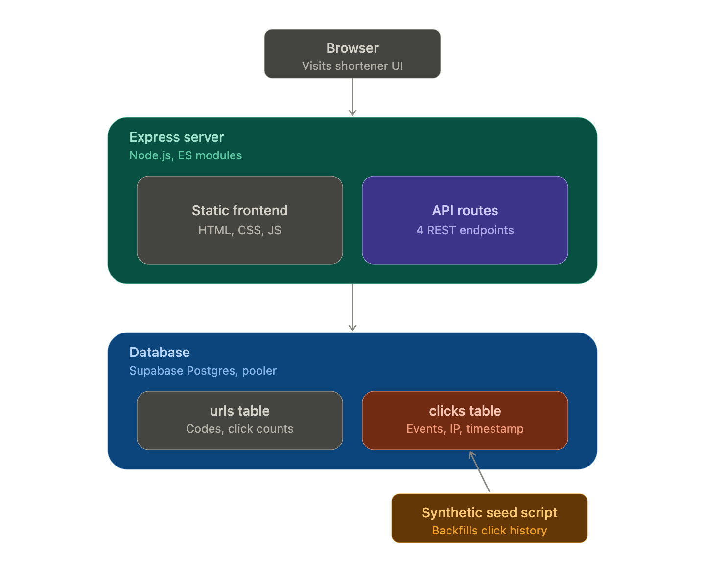

# URL Shortener

A URL shortener with click analytics, built as a system design learning project.

## Live Demo

https://url-shortener-giin.onrender.com/

## Tech Stack

- Node.js + Express (ES modules)
- PostgreSQL (Supabase, via connection pooler)
- Vanilla HTML/CSS/JS frontend (served statically by Express)

## Local Setup

1. Clone the repo: `git clone <repo-url>`
2. Install dependencies: `npm install`
3. Create a `.env` file:
   - DATABASE_URL=your_supabase_pooler_connection_string
   - BASE_URL=http://localhost:3000
4. Run the schema SQL (see `docs/schema.sql`) against your Postgres instance
5. Start the server: `node server.js`
6. Visit `http://localhost:3000`

## API Endpoints

- `POST /api/shorten` — body: `{ "url": "..." }`, returns `{ "shortUrl": "..." }`
- `GET /:shortCode` — redirects to original URL (302), logs click
- `GET /api/stats/:shortCode` — returns click count and metadata

## Design Decisions

See `docs/DECISIONS.md` for the reasoning behind key choices (encoding scheme, redirect status codes, duplicate handling, etc).

## Known Limitations

- No user accounts — all links are public/anonymous
- No click fraud detection (see DECISIONS.md)
- Free-tier hosting may have cold-start delay (~30-60s) after inactivity

## System Architecture

